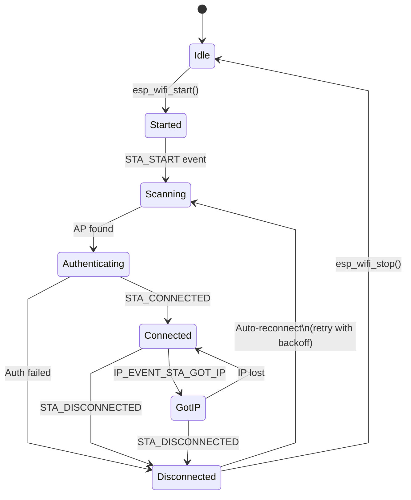

import TawkWidget from '../../../../components/TawkWidget.astro';
import UniversalContentContributors from '../../../../components/UniversalContentContributors.astro';
import InArticleAd from '../../../../components/InArticleAd.astro';
import Copyright from '../../../../components/Copyright.astro';
import BionicText from '../../../../components/BionicText.astro';
import TailwindWrapper from '../../../../components/TailwindWrapper.jsx';
import { Tabs, TabItem } from '@astrojs/starlight/components';
import { Card, CardGrid, Badge, Steps, LinkButton, FileTree } from '@astrojs/starlight/components';

<UniversalContentContributors 
  contributors={frontmatter.contributors}
/>


import EmbeddedProgrammingEsp32Comments from '../../../../components/embedded-programming-esp32/EmbeddedProgrammingEsp32Comments.astro';

Hardcoding Wi-Fi credentials into firmware means reflashing every time the network changes, and a naive blocking connect loop leaves your device unresponsive if the access point is down. Production Wi-Fi code needs an event-driven architecture that handles disconnections, retries, and credential provisioning without freezing the main application. In this lesson you will master the ESP-IDF Wi-Fi driver: connect as a station, run as an access point, provision credentials over SmartConfig (no hardcoding), and scan the radio spectrum. The project is a portable Wi-Fi signal mapper that builds a table of every nearby access point and serves the results as a self-hosted webpage. #ESP32 #WiFi #Networking

## What We Are Building

<Card title="Wi-Fi Signal Mapper" icon="star">
A portable Wi-Fi survey tool. The ESP32 starts in STA+AP mode: it connects to your home network for internet access while simultaneously running a soft AP you can join from any device. It performs periodic Wi-Fi scans, records RSSI, channel, SSID, and auth mode for every detected access point, and serves a live HTML table on its built-in HTTP server. Refresh the page to see updated scan results.
</Card>

**Project specifications:**

| Parameter | Value |
|-----------|-------|
| MCU | ESP32 DevKitC |
| Wi-Fi Mode | STA+AP (simultaneous station and access point) |
| Scan Interval | Every 10 seconds (configurable via menuconfig) |
| Data Collected | SSID, BSSID, RSSI (dBm), channel, auth mode |
| Max APs Tracked | 30 (sorted by signal strength) |
| Web Interface | HTTP server on port 80, auto-refresh HTML table |
| Provisioning | SmartConfig (first boot) or hardcoded fallback |
| Soft AP SSID | "ESP32-Mapper" (open, for local access) |
| New Parts Required | None |

### Bill of Materials

| Ref | Component | Quantity | Notes |
|-----|-----------|----------|-------|
| U1 | ESP32 DevKitC | 1 | Same board from previous lessons |
| | USB cable | 1 | For power and initial flashing |
| | Wi-Fi network | 1 | Any 2.4 GHz network for STA mode |

## Wi-Fi Driver Architecture

<InArticleAd />


The ESP32 Wi-Fi stack runs on a dedicated task created internally by `esp_wifi_start()`. Your application code never calls Wi-Fi functions from an ISR or directly manipulates the radio hardware. Instead, you interact with the driver through an event loop: you register handler functions, call API functions like `esp_wifi_connect()`, and the driver posts events (connected, disconnected, got IP) back to your handlers asynchronously.

```text
 ESP32 Wi-Fi Stack Layers
 ┌──────────────────────────────────┐
 │       Application Code          │
 │   (event handlers, API calls)   │
 ├──────────────────────────────────┤
 │       ESP-IDF Event Loop        │
 │  (WIFI_EVENT, IP_EVENT posts)   │
 ├──────────────────────────────────┤
 │      lwIP (TCP/IP Stack)        │
 │  (sockets, DHCP, DNS, mDNS)    │
 ├──────────────────────────────────┤
 │     Wi-Fi Driver (closed-src)   │
 │  (802.11 MAC, scan, auth)       │
 ├──────────────────────────────────┤
 │      Wi-Fi Hardware (PHY)       │
 │  (2.4 GHz radio, antenna)       │
 └──────────────────────────────────┘
```

### The Event Loop Model

ESP-IDF uses a default event loop for system events. The sequence for any Wi-Fi operation looks like this:

1. Create the default event loop with `esp_event_loop_create_default()`.
2. Register handler functions for the events you care about.
3. Initialize the Wi-Fi driver with `esp_wifi_init()`.
4. Configure the mode (STA, AP, or both) and call `esp_wifi_start()`.
5. The driver posts events to the loop; your handlers run in the event task context.



Here is the minimal initialization sequence:

```c
#include "esp_wifi.h"
#include "esp_event.h"
#include "nvs_flash.h"

/* Initialize NVS (required by the Wi-Fi driver for credential storage) */
esp_err_t ret = nvs_flash_init();
if (ret == ESP_ERR_NVS_NO_FREE_PAGES ||
    ret == ESP_ERR_NVS_NEW_VERSION_FOUND) {
    nvs_flash_erase();
    nvs_flash_init();
}

/* Initialize the TCP/IP stack */
esp_netif_init();

/* Create the default event loop */
esp_event_loop_create_default();

/* Create a default STA network interface */
esp_netif_create_default_wifi_sta();

/* Initialize the Wi-Fi driver with default config */
wifi_init_config_t cfg = WIFI_INIT_CONFIG_DEFAULT();
esp_wifi_init(&cfg);
```

The `WIFI_INIT_CONFIG_DEFAULT()` macro fills in sensible defaults for buffer sizes, task priorities, and internal resource allocation. You almost never need to change these values.

### Event Handler Registration

You register handlers for two event bases: `WIFI_EVENT` (connection state changes) and `IP_EVENT` (IP address assignment). Each handler receives the event ID and a pointer to event-specific data:

```c
static void wifi_event_handler(void *arg, esp_event_base_t event_base,
                                int32_t event_id, void *event_data)
{
    if (event_base == WIFI_EVENT) {
        switch (event_id) {
            case WIFI_EVENT_STA_START:
                esp_wifi_connect();
                break;
            case WIFI_EVENT_STA_DISCONNECTED:
                esp_wifi_connect();  /* Auto-reconnect */
                break;
            default:
                break;
        }
    } else if (event_base == IP_EVENT) {
        if (event_id == IP_EVENT_STA_GOT_IP) {
            ip_event_got_ip_t *event = (ip_event_got_ip_t *)event_data;
            ESP_LOGI(TAG, "Got IP: " IPSTR, IP2STR(&event->ip_info.ip));
        }
    }
}

/* Register the handler for both event bases */
esp_event_handler_instance_t wifi_handler;
esp_event_handler_instance_t ip_handler;

esp_event_handler_instance_register(WIFI_EVENT, ESP_EVENT_ANY_ID,
                                     &wifi_event_handler, NULL, &wifi_handler);
esp_event_handler_instance_register(IP_EVENT, IP_EVENT_STA_GOT_IP,
                                     &wifi_event_handler, NULL, &ip_handler);
```

The handler runs in the context of the default event loop task, not your application task. Keep handlers short: set flags, post to queues, or call simple API functions. Do not block or run long computations inside a handler.

## Station Mode (STA)

<InArticleAd />


Station mode connects the ESP32 to an existing Wi-Fi access point, just like your phone or laptop connects to a router. This is the most common mode for IoT devices that need internet connectivity.

### Connecting to an Access Point

After initializing the driver (as shown above), configure the SSID and password, then start the Wi-Fi subsystem:

```c
wifi_config_t wifi_sta_config = {
    .sta = {
        .ssid     = "YourNetworkSSID",
        .password = "YourNetworkPassword",
        .threshold.authmode = WIFI_AUTH_WPA2_PSK,
    },
};

esp_wifi_set_mode(WIFI_MODE_STA);
esp_wifi_set_config(WIFI_IF_STA, &wifi_sta_config);
esp_wifi_start();
```

When `esp_wifi_start()` returns, the driver posts `WIFI_EVENT_STA_START`. Your event handler calls `esp_wifi_connect()`, which triggers the association process. If the connection succeeds, the events arrive in this order:

1. `WIFI_EVENT_STA_CONNECTED`: Layer 2 association is complete (radio link established).
2. `IP_EVENT_STA_GOT_IP`: DHCP has assigned an IP address. The device is now fully connected.

### Auto-Reconnect Pattern

Wi-Fi links drop for many reasons: the router reboots, the signal is temporarily blocked, or the ESP32 moves out of range. A robust firmware reconnects automatically:

```c
static int s_retry_count = 0;
#define MAX_RETRY 10

static void wifi_event_handler(void *arg, esp_event_base_t event_base,
                                int32_t event_id, void *event_data)
{
    if (event_base == WIFI_EVENT &&
        event_id == WIFI_EVENT_STA_DISCONNECTED) {

        wifi_event_sta_disconnected_t *disconn =
            (wifi_event_sta_disconnected_t *)event_data;
        ESP_LOGW(TAG, "Disconnected, reason=%d", disconn->reason);

        if (s_retry_count < MAX_RETRY) {
            esp_wifi_connect();
            s_retry_count++;
            ESP_LOGI(TAG, "Reconnect attempt %d/%d", s_retry_count, MAX_RETRY);
        } else {
            ESP_LOGE(TAG, "Max retries reached. Stopping reconnect.");
        }
    }

    if (event_base == IP_EVENT &&
        event_id == IP_EVENT_STA_GOT_IP) {
        s_retry_count = 0;  /* Reset counter on successful connection */
        ip_event_got_ip_t *event = (ip_event_got_ip_t *)event_data;
        ESP_LOGI(TAG, "Connected. IP: " IPSTR, IP2STR(&event->ip_info.ip));
    }
}
```

The `disconnected_t` structure includes a `reason` field that tells you why the link dropped. Common reason codes include 2 (auth expired), 8 (station left), and 201 (no AP found). You can use these to decide whether to retry immediately or wait.

### Common Disconnect Reasons

| Reason Code | Constant | Meaning |
|-------------|----------|---------|
| 2 | `WIFI_REASON_AUTH_EXPIRE` | Authentication timed out |
| 8 | `WIFI_REASON_ASSOC_LEAVE` | Station voluntarily left |
| 15 | `WIFI_REASON_4WAY_HANDSHAKE_TIMEOUT` | WPA handshake failed (wrong password) |
| 201 | `WIFI_REASON_NO_AP_FOUND` | SSID not found during scan |
| 202 | `WIFI_REASON_AUTH_FAIL` | Wrong password |

## Access Point Mode (AP)

<InArticleAd />


In AP mode the ESP32 creates its own Wi-Fi network that other devices can join. This is useful for initial configuration (a phone connects to the ESP32 to enter credentials), local-only networks, or serving a web interface without a router.

### Creating a Soft AP

```c
/* Create the default AP network interface */
esp_netif_create_default_wifi_ap();

wifi_config_t wifi_ap_config = {
    .ap = {
        .ssid           = "ESP32-Mapper",
        .ssid_len       = strlen("ESP32-Mapper"),
        .password       = "",              /* Open network */
        .max_connection = 4,
        .authmode       = WIFI_AUTH_OPEN,
        .channel        = 1,
    },
};

esp_wifi_set_mode(WIFI_MODE_AP);
esp_wifi_set_config(WIFI_IF_AP, &wifi_ap_config);
esp_wifi_start();
```

The soft AP starts a built-in DHCP server automatically (configured by `esp_netif_create_default_wifi_ap()`). Clients that join receive IP addresses in the 192.168.4.x range, and the ESP32 itself is at 192.168.4.1 by default.

### Client Tracking

You can monitor which devices connect and disconnect by handling AP-specific events:

```c
static void ap_event_handler(void *arg, esp_event_base_t event_base,
                              int32_t event_id, void *event_data)
{
    if (event_id == WIFI_EVENT_AP_STACONNECTED) {
        wifi_event_ap_staconnected_t *event =
            (wifi_event_ap_staconnected_t *)event_data;
        ESP_LOGI(TAG, "Client connected, MAC=" MACSTR ", AID=%d",
                 MAC2STR(event->mac), event->aid);
    } else if (event_id == WIFI_EVENT_AP_STADISCONNECTED) {
        wifi_event_ap_stadisconnected_t *event =
            (wifi_event_ap_stadisconnected_t *)event_data;
        ESP_LOGI(TAG, "Client disconnected, MAC=" MACSTR, MAC2STR(event->mac));
    }
}
```

The `max_connection` field limits simultaneous clients. The ESP32 supports up to 10 connected stations in AP mode, though 4 is a practical default for memory-constrained applications.

## STA+AP Mode

<InArticleAd />


The ESP32 can run station and access point interfaces simultaneously. This is the mode we use for the signal mapper: the STA interface connects to your existing network (giving the ESP32 internet access if needed), while the AP interface lets you connect a phone or laptop directly to view results.

```text
 STA+AP Mode (Simultaneous)
 ┌──────────┐       ┌──────────────┐
 │  Home    │  STA  │              │  AP
 │  Router  │<─────>│    ESP32     │<─────>┌────────┐
 │          │ .100  │              │ .1    │ Phone/ │
 └──────────┘       │ 192.168.4.1 │       │ Laptop │
 192.168.1.x        │              │       └────────┘
  (existing)        └──────────────┘     192.168.4.x
                     SSID: ESP32-Mapper   (ESP32 AP)
```

```c
/* Create both network interfaces */
esp_netif_create_default_wifi_sta();
esp_netif_create_default_wifi_ap();

/* Set mode to STA+AP */
esp_wifi_set_mode(WIFI_MODE_APSTA);

/* Configure STA */
wifi_config_t sta_config = {
    .sta = {
        .ssid     = "YourNetworkSSID",
        .password = "YourNetworkPassword",
    },
};
esp_wifi_set_config(WIFI_IF_STA, &sta_config);

/* Configure AP */
wifi_config_t ap_config = {
    .ap = {
        .ssid           = "ESP32-Mapper",
        .ssid_len       = strlen("ESP32-Mapper"),
        .password       = "",
        .max_connection = 4,
        .authmode       = WIFI_AUTH_OPEN,
        .channel        = 1,
    },
};
esp_wifi_set_config(WIFI_IF_AP, &ap_config);

/* Start both interfaces */
esp_wifi_start();
```

There is one constraint to keep in mind: the ESP32 has a single radio, so both interfaces share the same channel. When the STA interface associates with a router on channel 6, the AP interface also operates on channel 6, regardless of what you set in the AP config. The `.channel` field in the AP config only applies when the STA interface is not connected.

## Wi-Fi Scanning

<InArticleAd />


The ESP32 can scan all 2.4 GHz channels (or a specific channel) and report every access point it detects. This is the core feature of our signal mapper.

### Scan API

A scan is a two-step process: start the scan, then retrieve results.

```c
/* Configure scan parameters */
wifi_scan_config_t scan_config = {
    .ssid        = NULL,         /* Scan for all SSIDs */
    .bssid       = NULL,         /* No BSSID filter */
    .channel     = 0,            /* Scan all channels */
    .show_hidden = true,         /* Include hidden networks */
    .scan_type   = WIFI_SCAN_TYPE_ACTIVE,
    .scan_time = {
        .active = {
            .min = 120,          /* Min dwell time per channel (ms) */
            .max = 150,          /* Max dwell time per channel (ms) */
        },
    },
};

/* Start a blocking scan */
esp_wifi_scan_start(&scan_config, true);

/* Get the number of APs found */
uint16_t ap_count = 0;
esp_wifi_scan_get_ap_num(&ap_count);

/* Allocate and retrieve the records */
wifi_ap_record_t *ap_records = malloc(sizeof(wifi_ap_record_t) * ap_count);
esp_wifi_scan_get_ap_records(&ap_count, ap_records);
```

When the second parameter of `esp_wifi_scan_start()` is `true`, the function blocks until the scan completes (typically 1 to 3 seconds for all 13 channels). Setting it to `false` makes the scan asynchronous; a `WIFI_EVENT_SCAN_DONE` event is posted when it finishes.

### Interpreting Scan Results

Each `wifi_ap_record_t` contains useful fields:

| Field | Type | Description |
|-------|------|-------------|
| `ssid` | `uint8_t[33]` | Network name (null-terminated) |
| `bssid` | `uint8_t[6]` | MAC address of the access point |
| `rssi` | `int8_t` | Signal strength in dBm (typical: -30 strong, -90 weak) |
| `primary` | `uint8_t` | Primary channel number (1 to 13) |
| `authmode` | `wifi_auth_mode_t` | Encryption type |

The `authmode` field is an enum. Here is how to convert it to a human-readable string:

```c
static const char *auth_mode_str(wifi_auth_mode_t authmode)
{
    switch (authmode) {
        case WIFI_AUTH_OPEN:            return "Open";
        case WIFI_AUTH_WEP:             return "WEP";
        case WIFI_AUTH_WPA_PSK:         return "WPA-PSK";
        case WIFI_AUTH_WPA2_PSK:        return "WPA2-PSK";
        case WIFI_AUTH_WPA_WPA2_PSK:    return "WPA/WPA2";
        case WIFI_AUTH_WPA3_PSK:        return "WPA3-PSK";
        case WIFI_AUTH_WPA2_WPA3_PSK:   return "WPA2/WPA3";
        case WIFI_AUTH_WAPI_PSK:        return "WAPI";
        default:                        return "Unknown";
    }
}
```

### RSSI Interpretation

RSSI values are negative numbers measured in dBm. Lower (more negative) values mean weaker signals:

| RSSI Range | Signal Quality |
|------------|---------------|
| -30 to -50 | Excellent |
| -50 to -60 | Good |
| -60 to -70 | Fair |
| -70 to -80 | Weak |
| Below -80 | Very weak, unreliable |

Each 3 dB decrease represents roughly half the power, and each 10 dB decrease represents roughly one-tenth the power. An AP at -40 dBm delivers about 100 times more power to the receiver than an AP at -60 dBm.

## SmartConfig Provisioning

<InArticleAd />


Hardcoding the SSID and password works during development, but a real product needs a way to accept credentials at deployment time. SmartConfig solves this problem: a phone app (such as Espressif's ESP-Touch) broadcasts the network credentials using a clever encoding scheme, and the ESP32 picks them up over the air.

### How SmartConfig Works

The phone must already be connected to the target Wi-Fi network. The SmartConfig app encodes the SSID, password, and other parameters into the lengths of specially crafted UDP broadcast or multicast packets. The ESP32, in promiscuous mode, captures these packets, decodes the credential information from the packet lengths, and then connects to the network.

```text
 SmartConfig Provisioning Flow
 ┌──────────┐    ┌──────────────┐    ┌──────────┐
 │  Phone   │    │   Wi-Fi AP   │    │  ESP32   │
 │ (app)    │    │   (Router)   │    │ (listen) │
 └────┬─────┘    └──────┬───────┘    └────┬─────┘
      │  1. User enters       │           │
      │     SSID+password     │           │
      │                       │           │
      │  2. Encode creds in   │           │
      │     UDP packet lens   │           │
      ├──────────────────────>│           │
      │                       │  3. ESP32 │
      │                       │  captures │
      │                       ├──────────>│
      │                       │           │
      │                       │  4. Decode│
      │                       │  & connect│
      │                       │<──────────┤
      │  5. Done notification │           │
      │<──────────────────────────────────┤
```

This approach works without any pre-existing connection between the phone and the ESP32. The ESP32 only needs to be in a listening state.

### SmartConfig Implementation

```c
#include "esp_smartconfig.h"

static EventGroupHandle_t s_wifi_event_group;
#define CONNECTED_BIT    BIT0
#define ESPTOUCH_DONE_BIT BIT1

static void smartconfig_event_handler(void *arg, esp_event_base_t event_base,
                                       int32_t event_id, void *event_data)
{
    if (event_base == WIFI_EVENT &&
        event_id == WIFI_EVENT_STA_START) {
        /* Start SmartConfig when station starts */
        ESP_LOGI(TAG, "Starting SmartConfig...");
        esp_smartconfig_set_type(SC_TYPE_ESPTOUCH);
        smartconfig_start_config_t sc_cfg = SMARTCONFIG_START_CONFIG_DEFAULT();
        esp_smartconfig_start(&sc_cfg);
    }

    if (event_base == SC_EVENT &&
        event_id == SC_EVENT_GOT_SSID_PSWD) {
        smartconfig_event_got_ssid_pswd_t *evt =
            (smartconfig_event_got_ssid_pswd_t *)event_data;

        wifi_config_t wifi_config = {0};
        memcpy(wifi_config.sta.ssid, evt->ssid, sizeof(wifi_config.sta.ssid));
        memcpy(wifi_config.sta.password, evt->password,
               sizeof(wifi_config.sta.password));

        ESP_LOGI(TAG, "SmartConfig got SSID: %s", (char *)evt->ssid);

        esp_wifi_disconnect();
        esp_wifi_set_config(WIFI_IF_STA, &wifi_config);
        esp_wifi_connect();
    }

    if (event_base == SC_EVENT &&
        event_id == SC_EVENT_SEND_ACK_DONE) {
        ESP_LOGI(TAG, "SmartConfig ACK sent, provisioning complete");
        esp_smartconfig_stop();
        xEventGroupSetBits(s_wifi_event_group, ESPTOUCH_DONE_BIT);
    }
}
```

### Storing Credentials in NVS

Once SmartConfig provides the credentials, you should save them so the device does not need provisioning on every reboot. The ESP-IDF Wi-Fi driver actually does this automatically: when you call `esp_wifi_set_config()`, it stores the configuration in NVS by default. On subsequent boots, calling `esp_wifi_start()` with the previously set configuration reconnects without SmartConfig.

You can control this behavior with `esp_wifi_set_storage()`:

```c
/* Store Wi-Fi config in flash (default behavior) */
esp_wifi_set_storage(WIFI_STORAGE_FLASH);

/* Or keep config in RAM only (lost on reboot) */
esp_wifi_set_storage(WIFI_STORAGE_RAM);
```

For the signal mapper, we use `WIFI_STORAGE_FLASH` so that the device remembers its configured network.

## Simple HTTP Server for Results

<InArticleAd />


The ESP-IDF includes a lightweight HTTP server (`esp_http_server`) that runs as a FreeRTOS task. It handles incoming connections, parses HTTP requests, and calls your registered URI handler functions. This is perfect for serving the scan results as a webpage.

### Setting Up the Server

```c
#include "esp_http_server.h"

static httpd_handle_t server = NULL;

static esp_err_t root_get_handler(httpd_req_t *req)
{
    /* We will build the HTML response here */
    const char *html = "<html><body><h1>Wi-Fi Signal Mapper</h1></body></html>";
    httpd_resp_set_type(req, "text/html");
    httpd_resp_send(req, html, HTTPD_RESP_USE_STRLEN);
    return ESP_OK;
}

static const httpd_uri_t root_uri = {
    .uri       = "/",
    .method    = HTTP_GET,
    .handler   = root_get_handler,
    .user_ctx  = NULL,
};

static httpd_handle_t start_webserver(void)
{
    httpd_config_t config = HTTPD_DEFAULT_CONFIG();
    config.stack_size = 8192;

    if (httpd_start(&server, &config) == ESP_OK) {
        httpd_register_uri_handler(server, &root_uri);
        ESP_LOGI(TAG, "HTTP server started on port %d", config.server_port);
    }
    return server;
}
```

The `HTTPD_DEFAULT_CONFIG()` macro sets the server to listen on port 80 with a maximum of 7 concurrent connections. The `stack_size` of 8192 bytes gives enough room for building moderately sized HTML responses.

### Sending Chunked Responses

For large HTML pages (like a table with 30 access points), use chunked transfer encoding to avoid allocating one giant buffer:

```c
static esp_err_t root_get_handler(httpd_req_t *req)
{
    httpd_resp_set_type(req, "text/html");

    /* Send the HTML header */
    httpd_resp_sendstr_chunk(req, "<!DOCTYPE html><html><head>"
        "<meta http-equiv='refresh' content='10'>"
        "<title>Wi-Fi Mapper</title></head><body>");

    /* Send table rows in a loop */
    char line[256];
    for (int i = 0; i < ap_count; i++) {
        snprintf(line, sizeof(line),
                 "<tr><td>%s</td><td>%d</td><td>%d</td></tr>",
                 (char *)ap_list[i].ssid,
                 ap_list[i].rssi,
                 ap_list[i].primary);
        httpd_resp_sendstr_chunk(req, line);
    }

    /* End the response */
    httpd_resp_sendstr_chunk(req, "</body></html>");
    httpd_resp_sendstr_chunk(req, NULL);  /* Signal end of chunks */
    return ESP_OK;
}
```

The `<meta http-equiv='refresh' content='10'>` tag tells the browser to reload the page every 10 seconds, giving you a live-updating display without any JavaScript.

## Complete Firmware

<InArticleAd />


The full source code below combines everything: STA+AP mode, periodic scanning, and an HTTP server that displays results in a styled HTML table. The code is a single `main.c` file.

```c
/* main.c -- Wi-Fi Signal Mapper
 *
 * ESP-IDF v5.x project.
 * Runs in STA+AP mode. The STA interface connects to your home network;
 * the AP interface ("ESP32-Mapper") lets any device connect directly.
 * Performs periodic Wi-Fi scans and serves results as an HTML table on port 80.
 */

#include <string.h>
#include <stdlib.h>
#include "freertos/FreeRTOS.h"
#include "freertos/task.h"
#include "freertos/event_groups.h"
#include "freertos/semphr.h"
#include "esp_system.h"
#include "esp_wifi.h"
#include "esp_event.h"
#include "esp_log.h"
#include "esp_netif.h"
#include "esp_http_server.h"
#include "esp_smartconfig.h"
#include "nvs_flash.h"

/* ---------- Configuration ---------- */

static const char *TAG = "wifi_mapper";

#define MAX_AP_RECORDS       30
#define SCAN_INTERVAL_MS     10000
#define AP_SSID              "ESP32-Mapper"
#define AP_MAX_CONN          4

/* STA credentials: set via menuconfig or SmartConfig */
#define DEFAULT_STA_SSID     CONFIG_WIFI_SSID
#define DEFAULT_STA_PASS     CONFIG_WIFI_PASSWORD

/* ---------- Global state ---------- */

static EventGroupHandle_t s_wifi_event_group;
#define STA_CONNECTED_BIT    BIT0
#define STA_GOT_IP_BIT       BIT1
#define SMARTCONFIG_DONE_BIT BIT2

static wifi_ap_record_t s_ap_records[MAX_AP_RECORDS];
static uint16_t s_ap_count = 0;
static SemaphoreHandle_t s_scan_mutex;
static httpd_handle_t s_server = NULL;
static int s_retry_count = 0;
#define MAX_RETRY 5

/* ---------- Auth mode to string ---------- */

static const char *auth_mode_str(wifi_auth_mode_t authmode)
{
    switch (authmode) {
        case WIFI_AUTH_OPEN:            return "Open";
        case WIFI_AUTH_WEP:             return "WEP";
        case WIFI_AUTH_WPA_PSK:         return "WPA";
        case WIFI_AUTH_WPA2_PSK:        return "WPA2";
        case WIFI_AUTH_WPA_WPA2_PSK:    return "WPA/WPA2";
        case WIFI_AUTH_WPA3_PSK:        return "WPA3";
        case WIFI_AUTH_WPA2_WPA3_PSK:   return "WPA2/WPA3";
        case WIFI_AUTH_WAPI_PSK:        return "WAPI";
        default:                        return "Unknown";
    }
}

/* ---------- RSSI to signal bar string ---------- */

static const char *rssi_bar(int8_t rssi)
{
    if (rssi >= -50) return "&#9608;&#9608;&#9608;&#9608;&#9608;";
    if (rssi >= -60) return "&#9608;&#9608;&#9608;&#9608;";
    if (rssi >= -70) return "&#9608;&#9608;&#9608;";
    if (rssi >= -80) return "&#9608;&#9608;";
    return "&#9608;";
}

/* ---------- Event handlers ---------- */

static void wifi_event_handler(void *arg, esp_event_base_t event_base,
                                int32_t event_id, void *event_data)
{
    if (event_base == WIFI_EVENT) {
        switch (event_id) {
            case WIFI_EVENT_STA_START:
                ESP_LOGI(TAG, "STA started, connecting...");
                esp_wifi_connect();
                break;

            case WIFI_EVENT_STA_CONNECTED:
                ESP_LOGI(TAG, "STA connected to AP");
                xEventGroupSetBits(s_wifi_event_group, STA_CONNECTED_BIT);
                break;

            case WIFI_EVENT_STA_DISCONNECTED: {
                wifi_event_sta_disconnected_t *d =
                    (wifi_event_sta_disconnected_t *)event_data;
                ESP_LOGW(TAG, "STA disconnected, reason=%d", d->reason);
                xEventGroupClearBits(s_wifi_event_group,
                                     STA_CONNECTED_BIT | STA_GOT_IP_BIT);
                if (s_retry_count < MAX_RETRY) {
                    esp_wifi_connect();
                    s_retry_count++;
                    ESP_LOGI(TAG, "Reconnect attempt %d/%d",
                             s_retry_count, MAX_RETRY);
                } else {
                    ESP_LOGE(TAG, "Max retries reached");
                }
                break;
            }

            case WIFI_EVENT_AP_STACONNECTED: {
                wifi_event_ap_staconnected_t *e =
                    (wifi_event_ap_staconnected_t *)event_data;
                ESP_LOGI(TAG, "AP client connected, MAC=" MACSTR,
                         MAC2STR(e->mac));
                break;
            }

            case WIFI_EVENT_AP_STADISCONNECTED: {
                wifi_event_ap_stadisconnected_t *e =
                    (wifi_event_ap_stadisconnected_t *)event_data;
                ESP_LOGI(TAG, "AP client disconnected, MAC=" MACSTR,
                         MAC2STR(e->mac));
                break;
            }

            default:
                break;
        }
    }

    if (event_base == IP_EVENT && event_id == IP_EVENT_STA_GOT_IP) {
        ip_event_got_ip_t *event = (ip_event_got_ip_t *)event_data;
        ESP_LOGI(TAG, "Got IP: " IPSTR, IP2STR(&event->ip_info.ip));
        s_retry_count = 0;
        xEventGroupSetBits(s_wifi_event_group, STA_GOT_IP_BIT);
    }
}

static void smartconfig_event_handler(void *arg, esp_event_base_t event_base,
                                       int32_t event_id, void *event_data)
{
    if (event_id == SC_EVENT_GOT_SSID_PSWD) {
        smartconfig_event_got_ssid_pswd_t *evt =
            (smartconfig_event_got_ssid_pswd_t *)event_data;

        wifi_config_t wifi_config = {0};
        memcpy(wifi_config.sta.ssid, evt->ssid,
               sizeof(wifi_config.sta.ssid));
        memcpy(wifi_config.sta.password, evt->password,
               sizeof(wifi_config.sta.password));

        ESP_LOGI(TAG, "SmartConfig SSID: %s", (char *)evt->ssid);

        esp_wifi_disconnect();
        esp_wifi_set_config(WIFI_IF_STA, &wifi_config);
        esp_wifi_connect();
    }

    if (event_id == SC_EVENT_SEND_ACK_DONE) {
        ESP_LOGI(TAG, "SmartConfig ACK done");
        esp_smartconfig_stop();
        xEventGroupSetBits(s_wifi_event_group, SMARTCONFIG_DONE_BIT);
    }
}

/* ---------- Wi-Fi initialization ---------- */

static void wifi_init(void)
{
    s_wifi_event_group = xEventGroupCreate();
    s_scan_mutex = xSemaphoreCreateMutex();

    /* TCP/IP and event loop */
    esp_netif_init();
    esp_event_loop_create_default();

    /* Create both STA and AP interfaces */
    esp_netif_create_default_wifi_sta();
    esp_netif_create_default_wifi_ap();

    /* Initialize the Wi-Fi driver */
    wifi_init_config_t cfg = WIFI_INIT_CONFIG_DEFAULT();
    esp_wifi_init(&cfg);

    /* Store config in flash so it persists across reboots */
    esp_wifi_set_storage(WIFI_STORAGE_FLASH);

    /* Register event handlers */
    esp_event_handler_instance_register(WIFI_EVENT, ESP_EVENT_ANY_ID,
                                         &wifi_event_handler, NULL, NULL);
    esp_event_handler_instance_register(IP_EVENT, IP_EVENT_STA_GOT_IP,
                                         &wifi_event_handler, NULL, NULL);
    esp_event_handler_instance_register(SC_EVENT, ESP_EVENT_ANY_ID,
                                         &smartconfig_event_handler, NULL, NULL);

    /* Set STA+AP mode */
    esp_wifi_set_mode(WIFI_MODE_APSTA);

    /* Configure STA */
    wifi_config_t sta_config = {
        .sta = {
            .ssid     = DEFAULT_STA_SSID,
            .password = DEFAULT_STA_PASS,
            .threshold.authmode = WIFI_AUTH_WPA2_PSK,
        },
    };
    esp_wifi_set_config(WIFI_IF_STA, &sta_config);

    /* Configure AP */
    wifi_config_t ap_config = {
        .ap = {
            .ssid           = AP_SSID,
            .ssid_len       = strlen(AP_SSID),
            .password       = "",
            .max_connection = AP_MAX_CONN,
            .authmode       = WIFI_AUTH_OPEN,
        },
    };
    esp_wifi_set_config(WIFI_IF_AP, &ap_config);

    /* Start Wi-Fi */
    esp_wifi_start();

    ESP_LOGI(TAG, "Wi-Fi initialized in STA+AP mode");
    ESP_LOGI(TAG, "AP SSID: %s (open, connect to access web UI)", AP_SSID);
}

/* ---------- Scan task ---------- */

static void scan_task(void *pvParameters)
{
    /* Wait briefly for Wi-Fi to fully start */
    vTaskDelay(pdMS_TO_TICKS(3000));

    ESP_LOGI(TAG, "Scan task started on core %d", xPortGetCoreID());

    while (1) {
        wifi_scan_config_t scan_cfg = {
            .ssid        = NULL,
            .bssid       = NULL,
            .channel     = 0,
            .show_hidden = true,
            .scan_type   = WIFI_SCAN_TYPE_ACTIVE,
            .scan_time = {
                .active = { .min = 120, .max = 150 },
            },
        };

        esp_err_t err = esp_wifi_scan_start(&scan_cfg, true);
        if (err != ESP_OK) {
            ESP_LOGW(TAG, "Scan failed: %s", esp_err_to_name(err));
            vTaskDelay(pdMS_TO_TICKS(SCAN_INTERVAL_MS));
            continue;
        }

        uint16_t count = 0;
        esp_wifi_scan_get_ap_num(&count);
        if (count > MAX_AP_RECORDS) {
            count = MAX_AP_RECORDS;
        }

        wifi_ap_record_t temp[MAX_AP_RECORDS];
        esp_wifi_scan_get_ap_records(&count, temp);

        /* Sort by RSSI descending (strongest first) */
        for (int i = 0; i + 1 < count; i++) {
            for (int j = i + 1; j < count; j++) {
                if (temp[j].rssi > temp[i].rssi) {
                    wifi_ap_record_t swap = temp[i];
                    temp[i] = temp[j];
                    temp[j] = swap;
                }
            }
        }

        /* Copy results under mutex protection */
        if (xSemaphoreTake(s_scan_mutex, pdMS_TO_TICKS(1000)) == pdTRUE) {
            memcpy(s_ap_records, temp, sizeof(wifi_ap_record_t) * count);
            s_ap_count = count;
            xSemaphoreGive(s_scan_mutex);
        }

        ESP_LOGI(TAG, "Scan complete: %d APs found", count);

        vTaskDelay(pdMS_TO_TICKS(SCAN_INTERVAL_MS));
    }
}

/* ---------- HTTP server ---------- */

static esp_err_t root_get_handler(httpd_req_t *req)
{
    httpd_resp_set_type(req, "text/html");

    /* HTML head with auto-refresh and embedded CSS */
    httpd_resp_sendstr_chunk(req,
        "<!DOCTYPE html><html><head>"
        "<meta charset='UTF-8'>"
        "<meta http-equiv='refresh' content='10'>"
        "<meta name='viewport' content='width=device-width, initial-scale=1'>"
        "<title>Wi-Fi Signal Mapper</title>"
        "<style>"
        "body { font-family: 'Segoe UI', Arial, sans-serif; margin: 20px;"
        "  background: #f5f5f5; color: #333; }"
        "h1 { color: #2c3e50; margin-bottom: 5px; }"
        "p.info { color: #666; font-size: 14px; margin-top: 0; }"
        "table { border-collapse: collapse; width: 100%;"
        "  background: white; box-shadow: 0 1px 3px rgba(0,0,0,0.12); }"
        "th { background: #2c3e50; color: white; padding: 12px 15px;"
        "  text-align: left; font-size: 14px; }"
        "td { padding: 10px 15px; border-bottom: 1px solid #eee;"
        "  font-size: 14px; }"
        "tr:hover { background: #f0f7ff; }"
        ".rssi-excellent { color: #27ae60; font-weight: bold; }"
        ".rssi-good { color: #2ecc71; }"
        ".rssi-fair { color: #f39c12; }"
        ".rssi-weak { color: #e74c3c; }"
        ".bar { font-size: 10px; letter-spacing: -1px; }"
        "</style></head><body>");

    httpd_resp_sendstr_chunk(req,
        "<h1>Wi-Fi Signal Mapper</h1>"
        "<p class='info'>Page refreshes every 10 seconds. ");

    /* Show AP count */
    char info[128];
    if (xSemaphoreTake(s_scan_mutex, pdMS_TO_TICKS(500)) == pdTRUE) {
        snprintf(info, sizeof(info),
                 "Detected <strong>%d</strong> access point%s.</p>",
                 s_ap_count, s_ap_count == 1 ? "" : "s");
        httpd_resp_sendstr_chunk(req, info);

        /* Table header */
        httpd_resp_sendstr_chunk(req,
            "<table><thead><tr>"
            "<th>#</th>"
            "<th>SSID</th>"
            "<th>BSSID</th>"
            "<th>Channel</th>"
            "<th>RSSI (dBm)</th>"
            "<th>Signal</th>"
            "<th>Auth</th>"
            "</tr></thead><tbody>");

        /* Table rows */
        for (int i = 0; i < s_ap_count; i++) {
            const char *css_class;
            if (s_ap_records[i].rssi >= -50)      css_class = "rssi-excellent";
            else if (s_ap_records[i].rssi >= -60)  css_class = "rssi-good";
            else if (s_ap_records[i].rssi >= -70)  css_class = "rssi-fair";
            else                                    css_class = "rssi-weak";

            /* Handle hidden SSIDs */
            const char *ssid = (char *)s_ap_records[i].ssid;
            if (ssid[0] == '\0') {
                ssid = "(hidden)";
            }

            char row[512];
            snprintf(row, sizeof(row),
                "<tr>"
                "<td>%d</td>"
                "<td><strong>%s</strong></td>"
                "<td>" MACSTR "</td>"
                "<td>%d</td>"
                "<td class='%s'>%d</td>"
                "<td class='bar %s'>%s</td>"
                "<td>%s</td>"
                "</tr>",
                i + 1,
                ssid,
                MAC2STR(s_ap_records[i].bssid),
                s_ap_records[i].primary,
                css_class, s_ap_records[i].rssi,
                css_class, rssi_bar(s_ap_records[i].rssi),
                auth_mode_str(s_ap_records[i].authmode));

            httpd_resp_sendstr_chunk(req, row);
        }

        xSemaphoreGive(s_scan_mutex);
    } else {
        httpd_resp_sendstr_chunk(req,
            "Scan data temporarily unavailable.</p>");
    }

    httpd_resp_sendstr_chunk(req, "</tbody></table></body></html>");
    httpd_resp_sendstr_chunk(req, NULL);  /* End chunked response */
    return ESP_OK;
}

static void start_webserver(void)
{
    httpd_config_t config = HTTPD_DEFAULT_CONFIG();
    config.stack_size = 8192;

    if (httpd_start(&s_server, &config) == ESP_OK) {
        httpd_uri_t root = {
            .uri       = "/",
            .method    = HTTP_GET,
            .handler   = root_get_handler,
            .user_ctx  = NULL,
        };
        httpd_register_uri_handler(s_server, &root);
        ESP_LOGI(TAG, "HTTP server started on port 80");
    } else {
        ESP_LOGE(TAG, "Failed to start HTTP server");
    }
}

/* ---------- SmartConfig task ---------- */

static void smartconfig_task(void *pvParameters)
{
    /* Only run SmartConfig if no stored credentials exist.
     * We check by waiting a few seconds for the STA to connect. */
    EventBits_t bits = xEventGroupWaitBits(s_wifi_event_group,
                                            STA_GOT_IP_BIT,
                                            false, false,
                                            pdMS_TO_TICKS(15000));

    if (bits & STA_GOT_IP_BIT) {
        ESP_LOGI(TAG, "STA connected, SmartConfig not needed");
        vTaskDelete(NULL);
        return;
    }

    ESP_LOGI(TAG, "STA not connected, starting SmartConfig...");
    ESP_LOGI(TAG, "Use the ESP-Touch app to send credentials");

    esp_smartconfig_set_type(SC_TYPE_ESPTOUCH);
    smartconfig_start_config_t sc_cfg = SMARTCONFIG_START_CONFIG_DEFAULT();
    esp_smartconfig_start(&sc_cfg);

    /* Wait for SmartConfig to complete or STA to connect */
    xEventGroupWaitBits(s_wifi_event_group,
                        STA_GOT_IP_BIT | SMARTCONFIG_DONE_BIT,
                        false, false, portMAX_DELAY);

    ESP_LOGI(TAG, "SmartConfig task done");
    vTaskDelete(NULL);
}

/* ---------- Entry point ---------- */

void app_main(void)
{
    ESP_LOGI(TAG, "Wi-Fi Signal Mapper starting");

    /* Initialize NVS */
    esp_err_t ret = nvs_flash_init();
    if (ret == ESP_ERR_NVS_NO_FREE_PAGES ||
        ret == ESP_ERR_NVS_NEW_VERSION_FOUND) {
        nvs_flash_erase();
        nvs_flash_init();
    }

    /* Initialize Wi-Fi in STA+AP mode */
    wifi_init();

    /* Start the HTTP server immediately (AP is already up) */
    start_webserver();

    /* Start the scanning task */
    xTaskCreatePinnedToCore(scan_task, "scan_task", 4096,
                            NULL, 5, NULL, 0);

    /* Start SmartConfig fallback task */
    xTaskCreate(smartconfig_task, "smartconfig_task", 4096,
                NULL, 3, NULL);

    ESP_LOGI(TAG, "Initialization complete");
    ESP_LOGI(TAG, "Connect to AP '%s' and open http://192.168.4.1", AP_SSID);
}
```

### How the Firmware Works

The firmware is organized into five cooperating layers:

1. **Wi-Fi initialization (`wifi_init`):** Creates both network interfaces, registers event handlers, configures STA+AP mode, and starts the driver. The STA interface attempts to connect using credentials from menuconfig (or previously stored SmartConfig credentials). The AP interface starts immediately with the SSID "ESP32-Mapper".

2. **Event handlers:** Two handler functions process all Wi-Fi, IP, and SmartConfig events. The Wi-Fi handler manages connection state, auto-reconnect with a retry limit, and AP client tracking. The SmartConfig handler receives provisioned credentials and applies them.

3. **Scan task (`scan_task`):** Runs on core 0 in a loop. Every 10 seconds, it performs a blocking active scan across all channels, retrieves the results, sorts them by RSSI (strongest first), and copies them into a shared buffer protected by a mutex.

4. **HTTP server:** Registered on port 80, it serves a single page at `/`. The handler reads the shared scan buffer (under mutex), builds an HTML table with SSID, BSSID, channel, RSSI, signal strength bars, and authentication mode. The page includes a `<meta>` refresh tag that reloads every 10 seconds.

5. **SmartConfig task:** Waits 15 seconds for the STA interface to connect. If it connects (using stored or hardcoded credentials), the task exits. If not, it starts SmartConfig and waits for the user to provision credentials via the ESP-Touch phone app.

### Thread Safety

The scan results are shared between the scan task (writer) and the HTTP handler (reader). A mutex (`s_scan_mutex`) protects this shared state. The scan task holds the mutex only while copying sorted results into the global buffer. The HTTP handler holds it while reading the buffer to generate HTML. Both operations are fast, so contention is minimal.

## CMakeLists.txt and Kconfig Files

<InArticleAd />


### Top-Level CMakeLists.txt

```cmake
cmake_minimum_required(VERSION 3.16)
include($ENV{IDF_PATH}/tools/cmake/project.cmake)
project(wifi-signal-mapper)
```

### main/CMakeLists.txt

```cmake
idf_component_register(SRCS "main.c"
                       INCLUDE_DIRS ".")
```

### main/Kconfig.projbuild

This file adds custom configuration options to menuconfig so you can set the SSID and password without editing source code:

```
menu "Wi-Fi Signal Mapper Configuration"

    config WIFI_SSID
        string "Wi-Fi SSID"
        default "myssid"
        help
            SSID of the access point to connect to in station mode.

    config WIFI_PASSWORD
        string "Wi-Fi Password"
        default "mypassword"
        help
            Password for the access point.

endmenu
```

### Project File Structure

<FileTree>
- wifi-signal-mapper/
  - CMakeLists.txt
  - main/
    - CMakeLists.txt
    - Kconfig.projbuild
    - main.c
</FileTree>

## Building and Flashing

<InArticleAd />


<Steps>
1. Create the project directory and add all four files:
   ```bash
   mkdir -p wifi-signal-mapper/main
   ```
   Place the top-level `CMakeLists.txt` in `wifi-signal-mapper/`, and place `CMakeLists.txt`, `Kconfig.projbuild`, and `main.c` in `wifi-signal-mapper/main/`.

2. Set the target chip:
   ```bash
   cd wifi-signal-mapper
   idf.py set-target esp32
   ```

3. Configure your Wi-Fi credentials using menuconfig:
   ```bash
   idf.py menuconfig
   ```
   Navigate to **Wi-Fi Signal Mapper Configuration** and enter your network's SSID and password. Save and exit.

4. Build the project:
   ```bash
   idf.py build
   ```

5. Connect the ESP32 DevKitC via USB and flash:
   ```bash
   idf.py -p /dev/ttyUSB0 flash monitor
   ```
   On macOS use `/dev/cu.usbserial-XXXX` or `/dev/cu.SLAB_USBtoUART`. On Windows use `COM3` or the appropriate port.

6. Watch the serial output for connection status:
   ```
   I (456) wifi_mapper: Wi-Fi Signal Mapper starting
   I (462) wifi_mapper: Wi-Fi initialized in STA+AP mode
   I (463) wifi_mapper: AP SSID: ESP32-Mapper (open, connect to access web UI)
   I (468) wifi_mapper: HTTP server started on port 80
   I (469) wifi_mapper: Initialization complete
   I (470) wifi_mapper: Connect to AP 'ESP32-Mapper' and open http://192.168.4.1
   I (1523) wifi_mapper: STA started, connecting...
   I (3842) wifi_mapper: Got IP: 192.168.1.105
   I (6503) wifi_mapper: Scan complete: 12 APs found
   ```

7. View the results from a phone or laptop:
   - Connect to the "ESP32-Mapper" Wi-Fi network (no password).
   - Open a browser and go to `http://192.168.4.1`.
   - You should see an HTML table listing all detected access points with SSID, BSSID, channel, RSSI, signal bars, and auth mode.
   - The page refreshes automatically every 10 seconds.

8. If the STA does not connect (wrong credentials or network not available):
   - Install the Espressif ESP-Touch app on your phone (available for iOS and Android).
   - After 15 seconds, the serial log will show "Starting SmartConfig..."
   - Open the ESP-Touch app, enter your Wi-Fi password, and tap "Confirm".
   - The ESP32 will receive the credentials, connect, and store them in flash for future boots.

9. Press `Ctrl+]` to exit the serial monitor.
</Steps>

## Exercises

<InArticleAd />


1. **Add a JSON API endpoint.** Register a second URI handler at `/api/scan` that returns the scan results as a JSON array instead of HTML. Each element should include `ssid`, `bssid`, `rssi`, `channel`, and `auth` fields. Use `httpd_resp_set_type(req, "application/json")` and build the JSON string manually with `snprintf`. Test it with `curl http://192.168.4.1/api/scan` from a terminal.

2. **Implement scan history tracking.** Modify the scan task to keep the last 5 scan results for each BSSID (use a ring buffer per AP). Add a `/history` endpoint that shows a small table for each AP with its RSSI over the last 5 scans, so you can see whether signal strength is improving or degrading as you walk around.

3. **Add WPA2 security to the soft AP.** Change the AP configuration to use `WIFI_AUTH_WPA2_PSK` with a password set via menuconfig. Add a new Kconfig entry `CONFIG_AP_PASSWORD` with a default value. Test that unauthorized devices cannot connect. Note how the DHCP server behavior remains unchanged.

4. **Build a channel utilization chart.** After each scan, count how many APs are on each channel (1 through 13). Add an `/channels` endpoint that displays a simple horizontal bar chart using HTML and inline CSS, where each bar's width is proportional to the number of APs on that channel. This visualization helps identify the least congested channel for your own network.

## Summary

<InArticleAd />


You explored the ESP32 Wi-Fi driver architecture and its event-driven programming model. You learned how station mode connects to an existing network with auto-reconnect logic, how soft AP mode creates a local network with a built-in DHCP server, and how STA+AP mode runs both simultaneously on a single radio. You implemented Wi-Fi scanning to discover nearby access points and extract their SSID, RSSI, channel, and authentication mode. You used SmartConfig as a provisioning mechanism that lets a phone app send credentials over the air without any pre-existing connection. Finally, you built a complete Wi-Fi signal mapper that combines all of these features: periodic scanning, a styled HTML dashboard served by the ESP-IDF HTTP server, auto-refresh, mutex-protected shared state, and SmartConfig fallback for first-time setup.

<EmbeddedProgrammingEsp32Comments />


<InArticleAd />
<TawkWidget />
<Copyright />